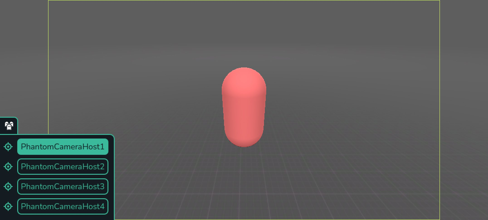

# Viewfinder

Preview what the `Camera` sees when attached to a `PCam`.

It's accessible from the bottom panel in the editor labelled `Phantom Camera`.

The viewfinder rendering of the scene will only work when the combination of a `Camera`, `PCamHost` and `PCam` are present and set up correctly.

## Video Example
<video controls>
<source src="/assets/videos/viewfinder.mp4">
</video>

## Dead Zones
When `Follow Mode` is set to [Framed](./follow-modes/framed.md), dead zones will also be visible in the `Viewfinder` and, if enabled, when playing the game from the editor.

::: info Note
Dead Zones will never be visible in build exports.
:::

## Multiple Phantom Camera Hosts

The moment two or more `PCamHost` are in a given scene, a small button will appear in the bottom left of the `Viewfinder` editor panel. Pressing on the icon, will open a list that displays all the `PCamHost` instances in the scene. Each list item contains two buttons; a small select icon, which will select the given `PCamHost` from the `Scene Hierarchy`, and a bigger button that will swap the `Viewfinder` to display the output of that `Camera2D/3D` that `PCamHost` belongs to.
